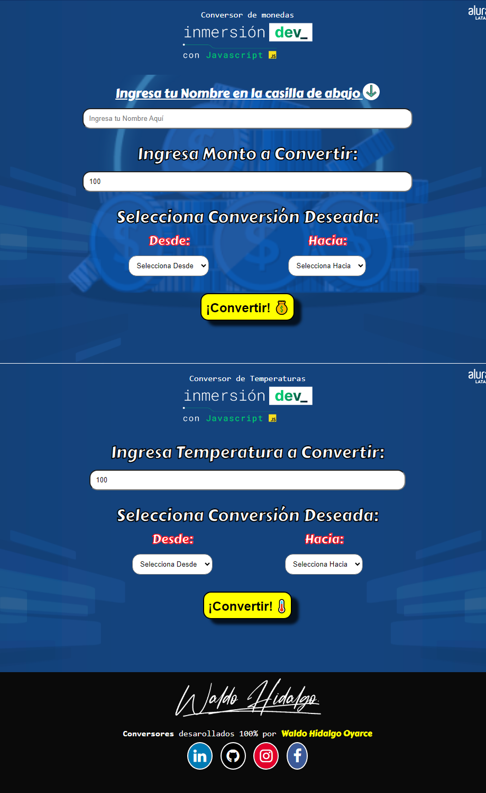
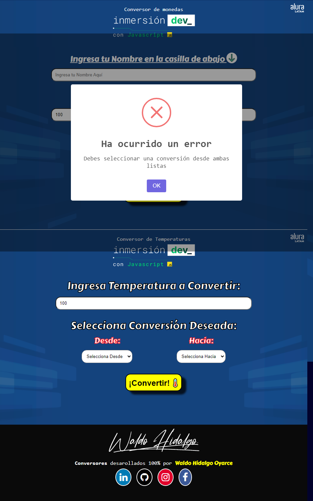
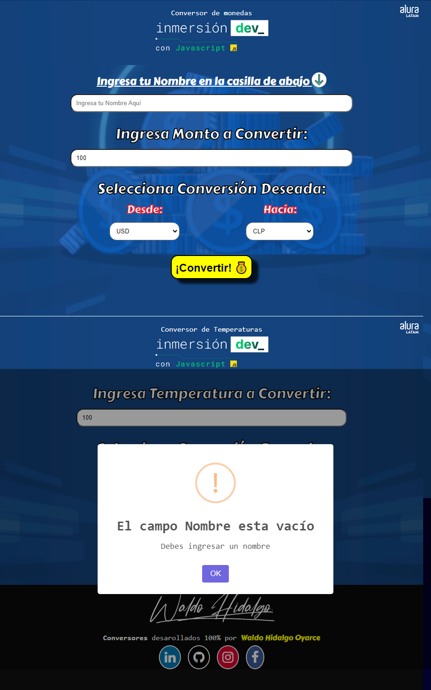
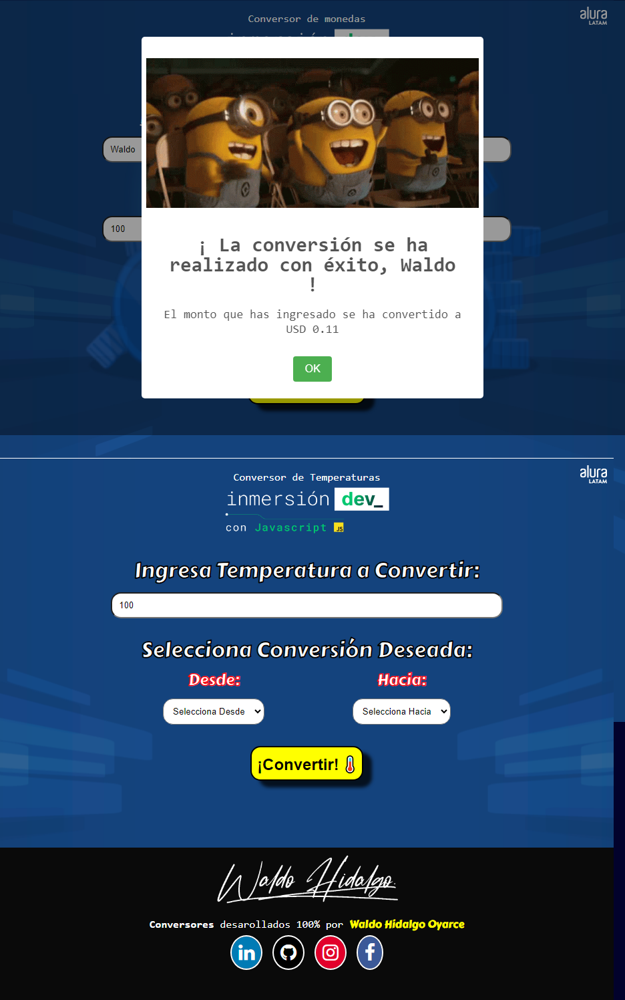

He resuelto de manera completa **todos** los desafíos dejados por el instructor y las dos intructoras en la primera clase de la semana de InmersiónDEV con JavaScript de AluraLatam. Aproveché lo que aprendí en el programa Oracle Next Education y me propuse realizar un proyecto más completo el cual se pueda acceder desde la web. En esta primera clase solo se abordo lo básico de JavaScript y no HTML ni CSS. Sin embargo, quise aprovechar la instancia para practicar ambas tecnologías. El proyecto que he construido consiste en un conversor de monedas entre USD, CLP, EURO y BITCOIN junto con un conversor de temperaturas entre Celsius, Fahrenheit y Kelvin, el ingreso de datos los realizo vía tags HTML y trabajo con esa información usando JavaScript. Mi proyecto cumple con los cuatro desafíos dejados los cuales son:

1-Agregar otras monedas para convertir;

2-Conversor de temperaturas entre fahrenheit, kelvin y celsius;

3-Agregar en el alert el nombre de la persona que está pidiendo la conversión;

4-Agregar una línea al proyecto desarrollado para que aparezca el valor en bitcoin.

Para la alerta he utilizado alertas de la librería SweetAlert. Además, utilizando JavaScript he agregado lógica adicional ya sea no permitir el ingreso de números negativos, alertas cuando no se ha ingresado data en los inputs o no se ha seleccionado monedas o temperaturas en las listas correspondientes.

Un resumen de la página completa es la siguiente:

Una alerta de error que se muestra cuando no se ha seleccionado elementos para conversión ya sea monedas o temperaturas:

Alerta de advertencia cuando se quiere realizar la conversión pero no se ha ingresado un nombre:

Por último, muestro la alerta de éxito cuando la conversión se ha realizado correctamente:

